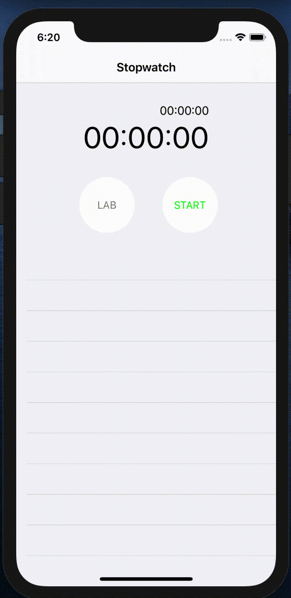

Stopwatch
==========

Stopwatch is the demo app of [Swift-30-Projects-02](https://github.com/soapyigu/Swift-30-Projects/tree/master/Project%2002%20-%20Stopwatch). Stopwatch is a Swift App that measures amount of time elapsed from a particular time. It highly mocks the stopwatch of Apple's offical App called Clock. This app supports functions such as lap record, time resume, and stopwatch reset.

## Screenshots

